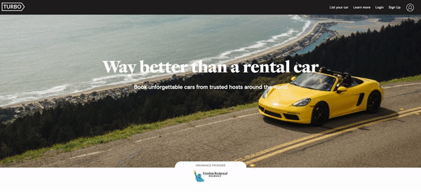

[Turbo Live Link](https://turbo-fsp.herokuapp.com/#/)

# Production Readme

Turbo is fullstack web application that utilizes Ruby on Rails for backend, PostgreSQL for database, React/Redux for frontend, and HTML/CSS for styling. It is inspired by Turo, a peer-to-peer car sharing platform.

## Technologies Used:

* [Ruby on Rails](https://rubyonrails.org/)
* [React](https://reactjs.org/)
* [Redux](https://redux.js.org/)
* [PostgreSQL](https://www.postgresql.org/)
* [Javascript]
* [HTML/CSS]

## Features:



Here is a demonstration of the signup/login modal with an animated demo user login.

### User Authentication

Users are required to signup or login in order to create cars and book rentals. User passwords are salted using the BCrypt hashing algorithm in order to be stored securely.

```ruby
class User < ApplicationRecord

    validates :first_name, :last_name, presence: true
    validates :email, :password_digest, :session_token, presence: true
    validates :email, uniqueness: true
    validates :password, length: { minimum: 6, allow_nil: true }

    after_initialize :ensure_session_token

    has_many :cars,
    foreign_key: :owner_id,
    class_name: :Car

    attr_reader :password

    def self.find_by_credentials(email, password)
        @user = User.find_by(email: email)
        @user && @user.is_password?(password) ? @user : nil
    end

    def password=(password)
        @password = password
        self.password_digest = BCrypt::Password.create(password)
    end

    def is_password?(password)
        BCrypt::Password.new(self.password_digest).is_password?(password)
    end

    def reset_session_token!
        self.session_token = SecureRandom.urlsafe_base64(16)
        self.save!
        self.session_token
    end

    def ensure_session_token
        self.session_token ||= SecureRandom.urlsafe_base64(16)
    end

end
```

## Demo Login

Using an async function I was able to display an animated demo login.

```javascript
async handleDemo(e) {
    e.preventDefault();

    const demoUser = {
        email: 'demo@email.com',
        password: 'password'
    };

    const sleep = ms => new Promise(res => setTimeout(res, ms));

    document.getElementById('email-input').focus();
    for (let i = 1; i <= demoUser.email.length; i++) {
        this.setState({ email: demoUser.email.substr(0, i) });
        await sleep(100);
    }

    await sleep(250);

    document.getElementById('password-input').focus();
    for (let i = 1; i <= demoUser.password.length; i++) {
        this.setState({ password: demoUser.password.substr(0, i) });
        await sleep(100);
    }

    await sleep(250);

    document.getElementById('session-submit-btn').click();
    document.getElementById('password-input').blur();
}
```

## Modal

Modal component that is rendered by managing the local state using Redux.

```javascript
function Modal({ modal, closeModal }) {

    if (!modal) {
        return null;
    }

    let component;
    switch (modal) {
        case 'Login':
            component = <LoginFormContainer />;
            break;
        case 'Signup':
            component = <SignupFormContainer />;
            break;
        default:
            return null;
    }

    return (
        <div className="modal-background" onClick={closeModal}>
            <div className="modal-child" onClick={e => e.stopPropagation()}>
                {component}
            </div>
        </div>
    );
}

export default Modal
```


## Future Releases:

- Completion of car CRUD feature
- Rentals
- Reviews
- Search
- User Show Page
- Favorites